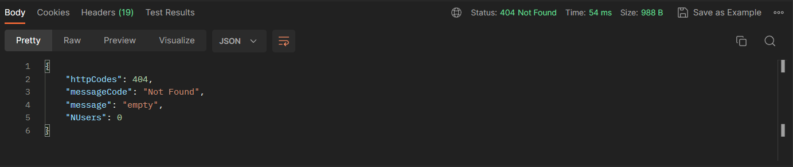

# Servidor con express

---
## INDICE

1. introduccion al servidor
2. modulo server
3. modulo controller
    * manejo de peticiones para autenticarse
    * manejo de petciones para registrarse
    * otros controladores
4. modulo de rutas
    * definición de rutas
    * middleware
        * verificación de usuario existente
        * verificación de roles
        * verificación de validez de los tokens

5. modulo de servicios

    * modulo de consultas a la tabla de usuarios
    * modulo de consultas a la tabla de alumnos

6. configuración de la conexion con la base de datos  

## introduccion al servidor  

El servidor de express nos permite realizar consultas a la base de datos asi como recivir peticiones http de un cliente y enviar los datos solicitados. El servidor se compone de 4 partes fundamentales 

* servidor: Contiene las configuraciones iniciales por medio de midlewares  
ademas de contener las rutas raices de cada uno de los enpoints que se encuentran en el modulo de rutas

* las rutas: contiene los endpoints propiamente dicho los cuales establecen las rutas especificas y el metodo http que se va a utilizar. Al estar utilizando una aplicación en la que los roles están presentes utilizamos una especie de filtros ,antes de responder la petición http, para los usuarios que pasan utilizan determinadas rutas, estos filtros son los midlewares.

* los controladores: los controladores es el modulo intermedio que esta entre la capa servicios y la capa de rutas, lo que realiza es manejar las llamadas y tratar los posibles errores que se puedan ocacionar.

* el servicio: es el modulo encargado de hacer las consultas a la base de datos, por lo que contienen instrucciones SQL.

A continuación se muestra un esquema del funcionamiento de la base de datos.

## modulo del servidor 
---

el modulo del servidor es el encargado de arrancar el servidor y que los diferentes enpoints queden a la escucha de una posible petición por parte del cliente en un puerto determinado.
este modulo tiene unos midlewares que ayudan a su configuración inicial los cuales se mostrarán a continuacion

    app.use(cors())

añade las politicas de cors para que el servidor pueda responder 
a las peticiones desde el navegador

    app.disable('x-powered-by')
    app.disable('etag')
    app.use(helmet())

inabilita las etiquetas que da información sobre la version de express 
y la de las librerias que estamos utilizando

    app.use(express.json())

habilita al servidor para que pueda
    recibir datos en formato json

    app.use('/api/user', userRoutes)

define las rutas principales antes de iniciar el server

Luego tenemos dos funciones que se llaman desde app donde tendremos la inicialización del servidor y otra función para pararlo.    

## modulo routes
---
el modulo rutas es el modulo encargado de resolver las peticiones correspondientes a la ruta que se le ha asignado tendremos.

Este modulo está dividido por diferentes partes que se corresponden con la tabla que tratan. Las que existen actualmente son:

* usuarios: son rutas relacionadas con la gestion de los usuarios el las cuales encontramos  

      router.route("/count").get(controller.getUserCount)

    muestra el numero de úsuarios que hay registrados  
      
       router.route("/userById/:token").get(controller.getUserByToken)

    esta ruta devuelve los datos de un usuario dado un token especifico que se le pasa como parametro en la misma ruta

      router.route("/get").get([verifyToken, isAdmin],controller.getAllUserController)
    
    esta ruta devuelve todos los usuários, para acceder a este endpoints se necesita el token de un usuario admin, el cual es pasado por el header, para ello tenemos las llamadas de los midlewares entre corchetes que se encargarán de verificar si el usuario tiene autorización

      router.route("/register").post([verifyToken,isAdmin,verifyUser],controller.sigUp)
    
    esta ruta permite registrar nuevos usuariós tiene implementado midlewares ya que se trata de una funcionalidad que solo puede ejecutar un administrador, en esta ruta es necesaría pasarle los datos del nuevo usuario mediante un objeto que se le pasa en el body de la petición.

        router.route("/login").post(controller.sigIn)
    
    esta ruta permite a un usuario logearse, introduciendo una contraseña y su email por medio de un body, y te devolvera un token.

* alumnos: son rutas relacionadas con la gestion de los alumnos de las cuales encontramos:

    (pendiente de desarrollar)

## modulo de midlewares
---
 este modulo trata establecer los midlewares, que son trozos de codigos que se ejecutan despues de realizar una peticion y antes de hacer una consulta. los midlewares que tenemos son los siguientes:

* verifyToken (en el fichero authjwt): se encarga de verificar de que un token es valido el caso de que sea valido sigue la ejecución, en el caso de que no exista enviara un mensaje de error.

* isAdmin (en el fichero authjwt): se encarga de verificar de que el token es de un administrador. En el caso de que sea sigue la ejecución, en el caso de que no sea enviara un mensaje de error.

* verifyUser (en el fichero verifyUser): se encarga de verificar si el usuario existe o no, en el caso de que exista enviara un mensaje de error, en el caso de que no exista seguira con la ejecución.

## modulo de controladores
---

Los controladores es una capa que esta entre las rutas y las consultas a la base de datos. aquí las peticiones que llegán son tratadas y para que en el caso de falla el servidor pueda dar una respuesta. Los controladores al igual que las ruta lo dividimos en:

* userController: estos son ecargados de controlar todo lo relacionado con los usuarios como por ejemplo los registros, los logeos, etc. aqui podemos ver los siguientes controladores.

    * getUserCount: se encarga de controlar y devolver el numero de usuarios registrados. este controlador puede devolver tres mensajes diferentes.
        * en el caso de que halla sido un exito devolvera lo siguiente

        

        * en el caso de este vacio devolvera  

        

        * en caso de que alla algun tipo de fallo tendra este mensaje  

        
    
    * getAllUserController: es el que se encarga de controlar y devolver todos los usuarios registrados en la base de datos y controlar los errores que puedan surgir de la busqueda este controlador lanza 3 mensajes diferentes.
        * en el caso de que halla sido un exito devolvera los siguiente

        

        * en el caso de que no halla usuarios registrados devolvera

        

        * en el caso el halla un fallo en el servidor devolvera

        
    
    * getUserByToken: se encarga de controlar el endpoint que devuleve un usuario dado un token, este controlador transforma el token devuelto por medio de una clave en una id y llama a services para que aga la consulta con esa id y devuelve el dato con un mensaje. Ademas se encarga de controlar los errores que puedan surgir y enviar los siguientes mensajes.

        * en el caso de que halla sido un exito devolvera los siguiente

        

        * en el caso de que el usuario no se encuentre devolvera

        

        * en el caso de que halla un error en el servidor

        

    * sigUp: este controlador es el encargado de manejar los fallos del del registro ademas de encriptar las contraseñas de los nuevos usuarios para luego guardarlas y generar un token una vez registrado el usuario, este controlador devuelve diversos mensajes.
        
        * en el caso de que el registro se halla realizado con exito devolvera un token con el siguiente mensaje

        

        * en el caso de que no se pasen todos los datos necesarios para registrar un usuario

        

        * en el caso de que no se pueda conectar con la base de datos

        

        * en el caso de que introduzca un rol erroneo 

        
    
    * sigIn: es el controlador encargado manejar los errores producidos por el logeo de un usuario ademas es el encargado de que si la autenticación fue un exito de generar un token y enviarselo al cliente, este controlador puede enviar los siguientes mensajes.

        * En el caso de que todo este correcto enviara el token
        
        

        * En el caso de que el usuario no exista mostrara lo siguiente

        

        * En el caso de que el usuario no introduzca las credenciales

        

        * En el caso de que el usuario exista pero la contraseña no es la misma

        

        * En el caso de que halla un fallo en el servidor

        

* aluController: estos son encargados de controlar todo lo relacionado con los alumnos

## modulo de servicios
---

El modulo de servicios es el encargado de hacer las consultas a la base de datos y se divide en:

* servicio de usuarios: tiene todos las consultas relacionadas con los usuarios este cuenta con las siguientes consultas.

    * getUserCount: se encarga de pedir cuantos usuarios hay registrados

    * getUser: se engarga de devolver todos los usuarios

    * getUserByEmail: se encarga de devolver el usuario con un email especifico

    * getUserByName: se encarga de devolver el usuario con un nombre especifico

    * getUserById: se encarga de devolver el usuario con un id en especifico

    * insertUser: inserta un usuario dado unos datos pasados por parametro

    
    

